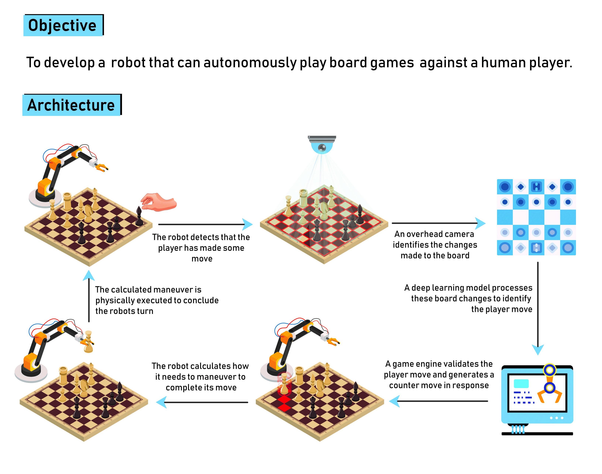
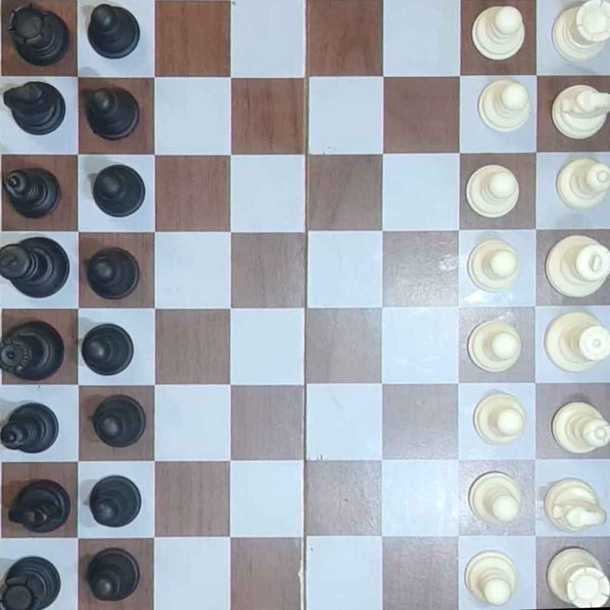

# Autonomous Game-Playing Robot

## Installation:

1. Install Python 3.7. Do not install the latest 3.8 version as it is not compatible with TensorFlow.
1. Install the Arduino application.
1. Install DRV8825.h libray from Sketch -> Include Libraries -> Manage Libraries
1. Select Arduino Nano from Tools -> Board
1. Select ATmega328P (Old Bootloader) from Tools -> Processor
1. Connect the Arduino to the laptop containing the rest of the code.
1. Upload the angles.ino file from the repository to the Arduino.
1. Install Stockfish.
1. Create a new conda environment using the requirements.txt from the repository.
1. Configure the constants, specifically providing paths for the Stockfish engine, the CNN model and the angles.txt file.
1. Install IPWebcam application on an Android phone and start it. Copy the associated IP to the constants.
1. Look up the port in Arduino and copy it to the constants as well.
1. Place the phone on the stand, making sure the whole chessboard is visible.
1. Make sure all the chess pieces are in their correct places.
1. Run main.py

## Explaination:

1. The Model-1 extracts the chess board from the Original Image into a 1200 x 1200 image.
1. The Output of the 1st Model is divided into 64 equal pieces 150 x 150 (using slice function) so that each square could be recognized individually.
1. The Model-2 generates an Array which represents the chess Board.
1. The Board Array is converted to FEN Notation and is fed to the Chess Engine (Stockfish) for counter Move Generation.
1. Make sure that the Black Chess pieces are on the left side of the image (if not use the python rotate function as per your need).

## Inspired by:

Raspberry Turk, by Joey Meyer. His implementation can be found at http://www.raspberryturk.com/
